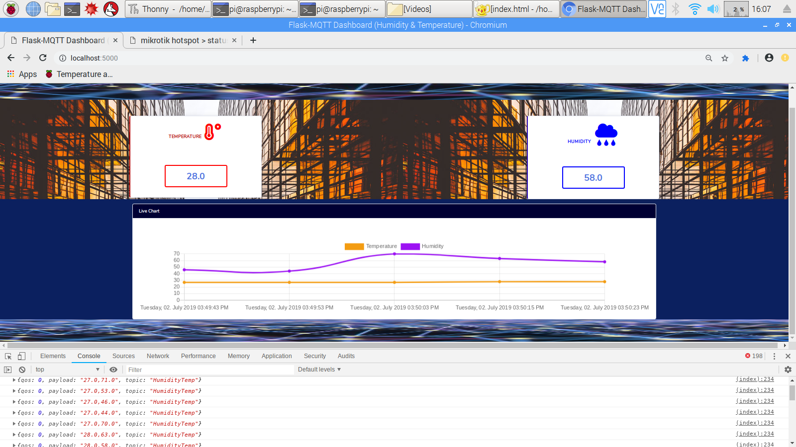

# IoT

IoT Dashboard with Flask-MQTT


based on [https://github.com/stlehmann/Flask-MQTT](https://github.com/stlehmann/Flask-MQTT)



## Contributors:
- [x] Alireza Alemi -> Hardware
- [x] Ranaa Airang -> Client Base
- [x] Mozhgan Norouzi -> Client Chart
- [x] Sahar BahramPour -> Client Video Streaming
- [x] Hasan Aphapour & Ata Miri -> Sensor Connection 
- [x] Mahmood Arab -> Supervisor
- [x] Sina BeikNejad -> Backend


## Run Instruction:
>First run Mosquitto Broker on ```localhost:1883```

>then ```python app.py```

> Please consider don't run with ```flask run``` because of using SocketIO

> Then Open ```localhost:5000``` on your browser